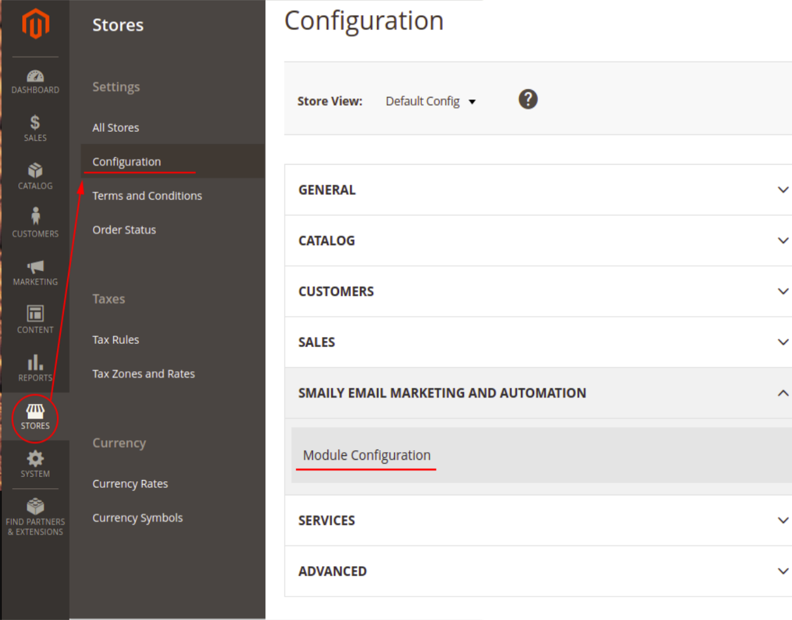
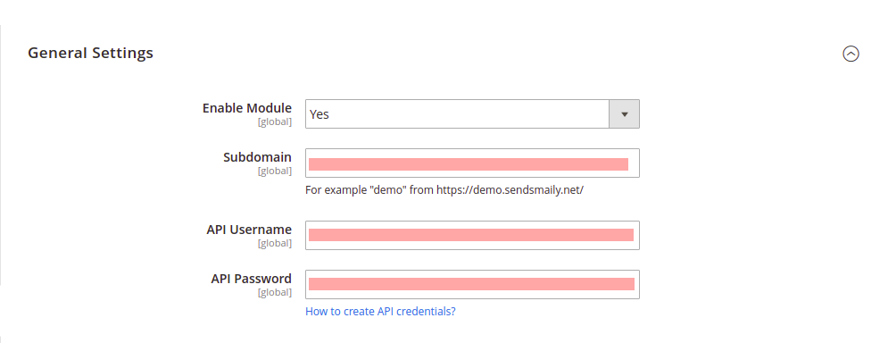
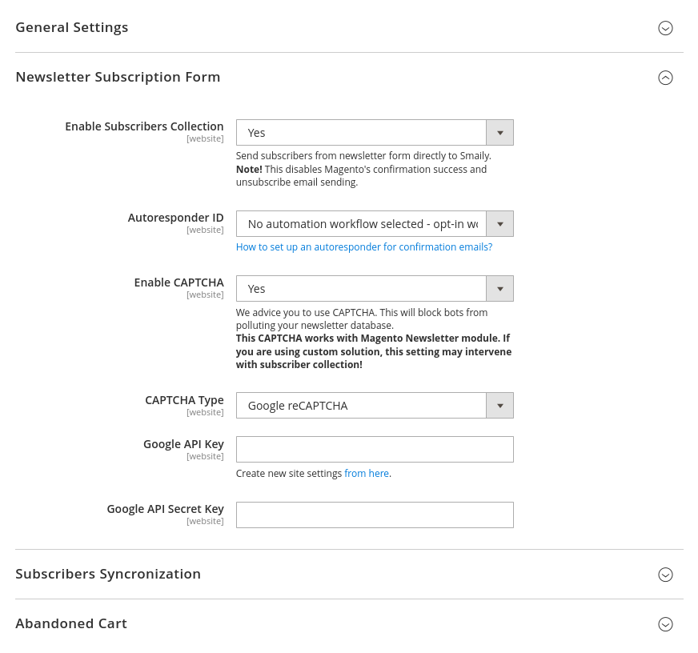
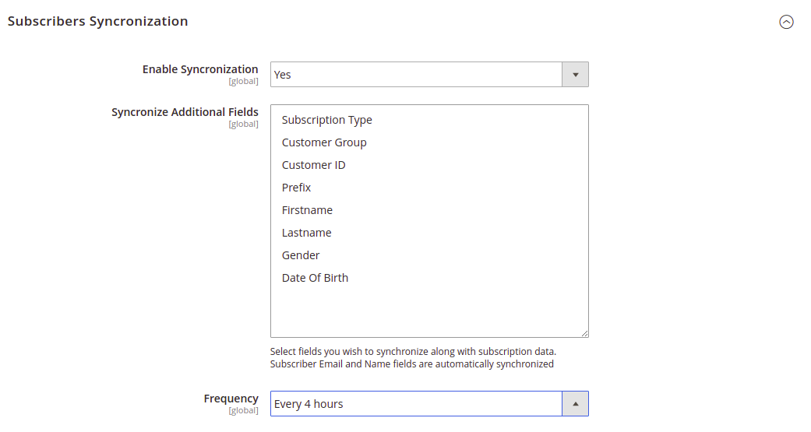
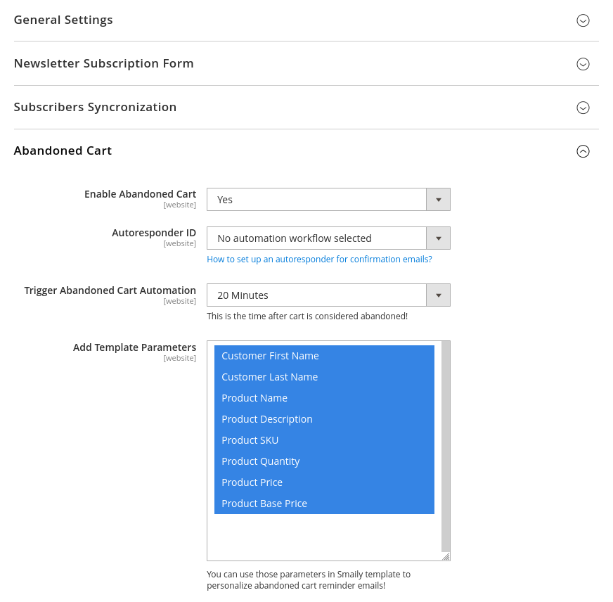

# User guide

## Smaily E-Commerce extension for Magento 2.3+
>[Smaily](https://smaily.com/) is an intentionally simple tool for sending beautiful email newsletters.

## Installation

1. You can get **Smaily E-Commerce extension for Magento 2.0+** from [Magento marketplace](https://marketplace.magento.com/smaily-smailyformagento.html) or download it from our [GitHub repository](https://github.com/sendsmaily/smaily-magento-extension).

2. To install our extension follow the [Magento extension installing guide](https://docs.magento.com/marketplace/user_guide/buyers/install-extension.html)

## Connecting to Smaily account

3. To start using Smaily extension navigate to **Stores -> Configuration** section. On the configuration page, find **Smaily Email Marketing and Automation** tab, then click on **Module Configuration**

4. On extension configuration page enter your Smaily API credentials - **subdomain, username, and password**. You must create your API account in Smaily first. You can follow our [tutorial](https://smaily.com/help/api/general/create-api-user/) to create one. After that, you can **validate connection** by saving configuration.

## Newsletter subscription form

4. You can **collect newsletter subscribers directly to your Smaily account** using Magento built-in newsletter subscription form.

5. We recommend to **use CATPCHA** to prevent bots from polluting your newsletter subscribers list. You can use two options - **Magento's text-based CAPTCHA or Google reCAPTCHA**.

## Subscribers synchronization

6. Enable automatic subscribers synchronization feature under **Subscribers synchronization** section.

7. There is an option to **import additional fields** available from store into Smaily to personalize newsletter emails.

8. The synchronization **frequency can be adjusted** globally (not by website). Available values are: every 4 hours, twice a day, every day and once a week.

9. Synchronization datetime range starting date can be configured per website or reset to execute full synchronization.

## Abandoned cart emails

10. Enable abandoned cart emails feature under **Abandoned Cart** section to send cart reminder emails to store customers.

11. You need to create *form submitted* workflow in Smaily prior to activating this feature. You can follow our [creating automation workflows tutorial](https://smaily.com/help/user-manual/automations/automation-workflows/).

12. After creating automation in Smaily you can find this automation under **Autoresponder ID**.

13. You can **choose timing** when cart is considered abandoned form 20 minutes up to 12 hours.

14. There is also an option to **add additional parameters** about abandoned carts to send personalized reminder emails.

