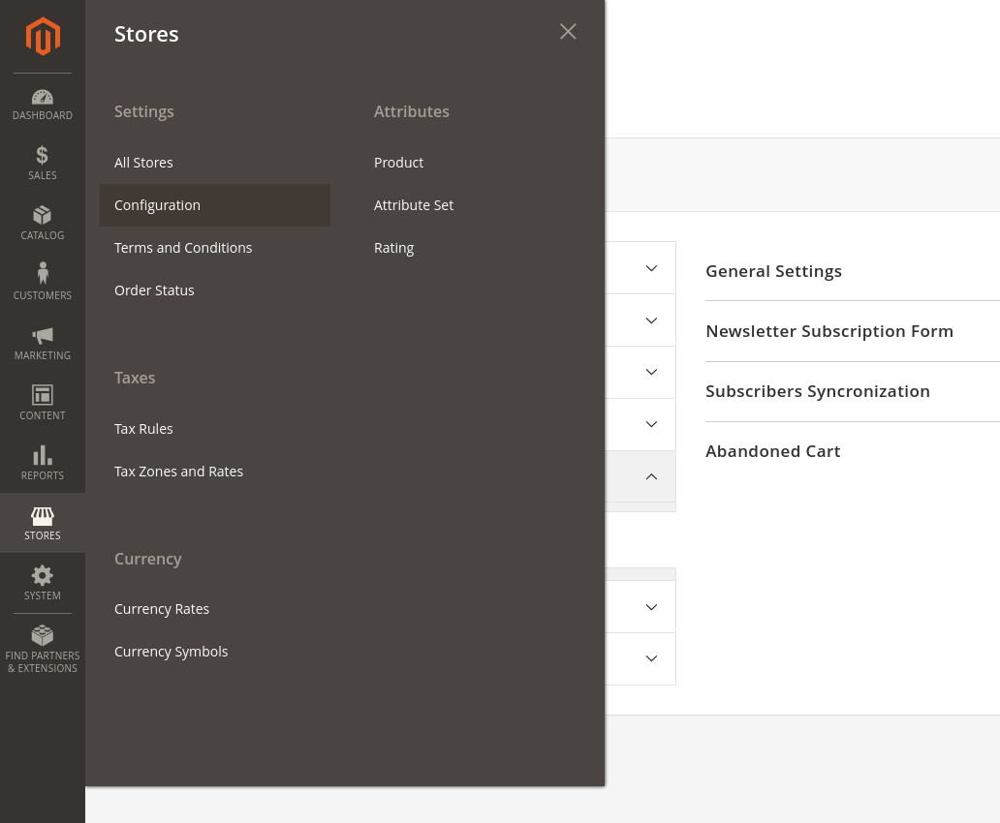
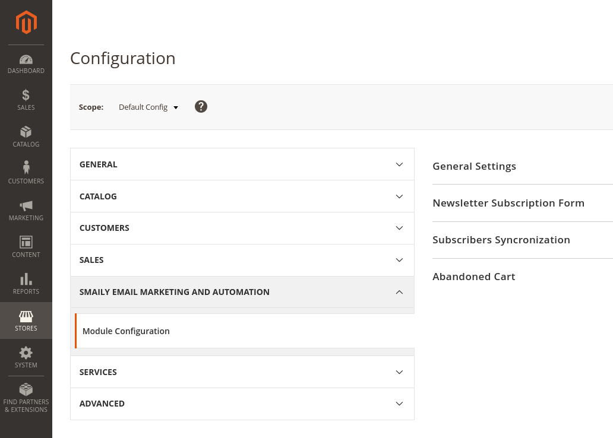
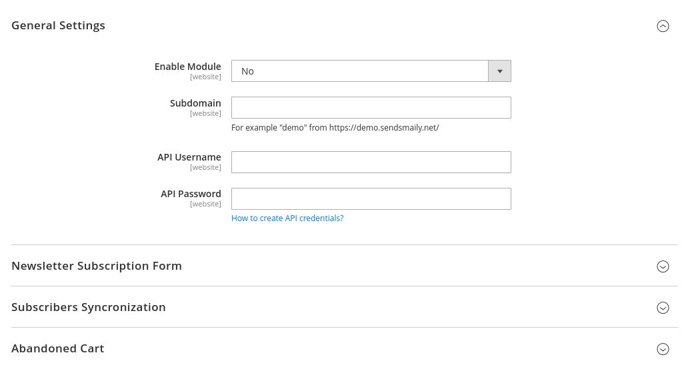
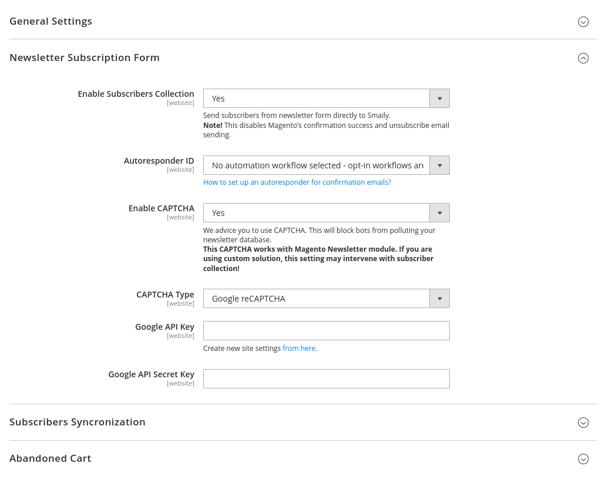
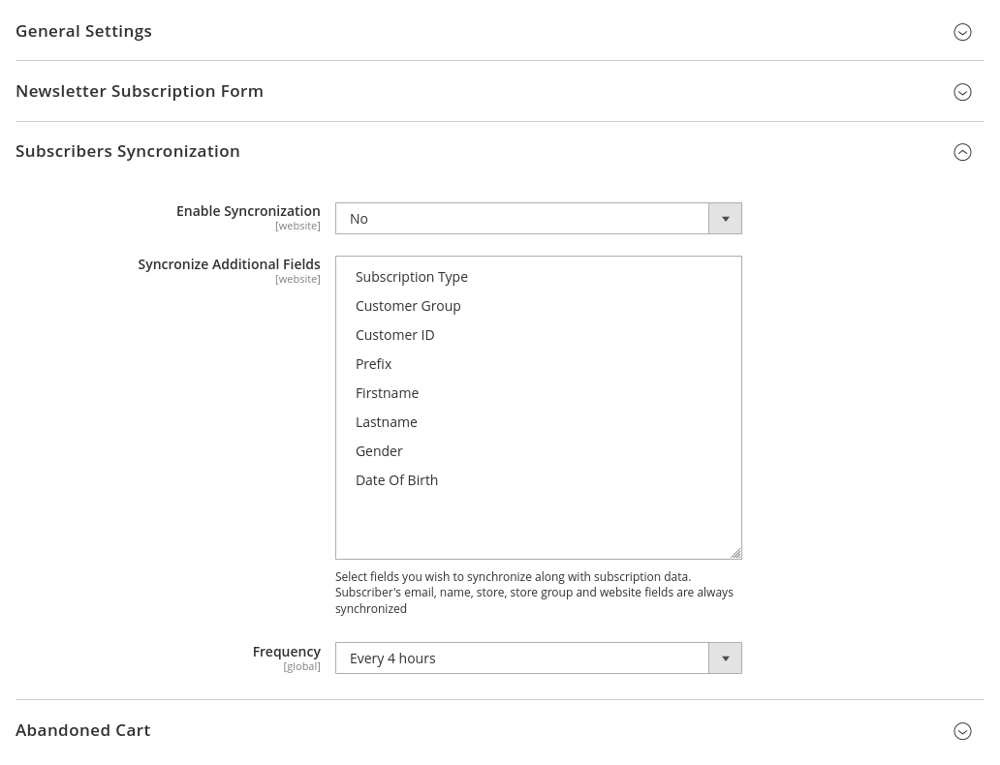
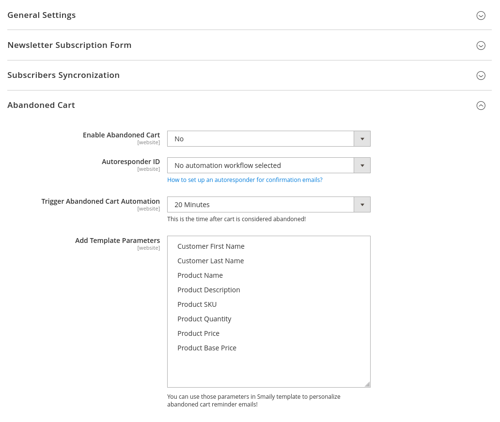

# User guide

[Smaily](https://smaily.com/) is an intentionally simple email marketing and automation tool. We'll give you the most easy to use tool to send beautiful newsletters. For everything else we have integrations.

## Installation

You can get **Smaily for Magento** from [Magento Marketplace](https://marketplace.magento.com/smaily-smailyformagento.html) or download it from our [GitHub repository](https://github.com/sendsmaily/smaily-magento-extension).

Follow the [Magento extension installing guide](https://docs.magento.com/marketplace/user_guide/buyers/install-extension.html) on installing the extension.

## Connecting to your Smaily account

Navigate to **Stores** → **Configuration** section.

On the configuration page, find **Smaily Email Marketing and Automation** tab, then click on **Module Configuration**.

On module configuration page enter your Smaily API credentials - **subdomain**, **username**, and **password**. Please follow our guide on [creating an API user](https://smaily.com/help/api/general/create-api-user/). Make sure to click **Save Config** to validate the connection.

## Newsletter Subscription Form

This feature allows you to collect Magento Newsletter Subscribers directly to Your Smaily account using Magento's built-in Newsletter Subscription Form.

> Note! Enabling the Newsletter Subscription Form feature will disable Magento's subscriber welcome and unsubscribe confirmation email sending.

We recommend **enabling CAPTCHA** to prevent bots from polluting your Newsletter Subscribers list. Both **Magento's text-based CAPTCHA** and **Google reCAPTCHA** are supported.

## Subscribers Synchronization

This feature allows you to synchronize your Magento Newsletter Subscribers to Smaily. It runs as a recurring CRON job, which requires the Magento CRON to be configured.

Subscribers Synchronization can be fine-tuned to suit your needs by synchronizing additional personalization fields (Subscription Type, Customer Group, Customer ID, Prefix, Firstname, Lastname, Gender and Date Of Birth), or adjusting the frequency of the synchronization (every 4 hours, twice a day, every day or once a week).

Subscribers Synchronization can be configured (per website) to start synchronizing subscribers from specific date or reset to execute full synchronization.

## Abandoned Cart

This feature enables you to send Abandoned Cart reminder emails to customers who have added products to shopping cart, but haven't finished checking out.

Abandoned Cart reminder emails can be fine-tuned to suit your business needs by adjusting the time after the cart is considered abandoned, or including additional parameters to personalize the Abandoned Cart email.

**Note!** You need to create a *form submitted* automation workflow in Smaily prior to activating this feature. Please follow our guide on [creating automation workflows](https://smaily.com/help/user-manual/automations/automation-workflows/).

